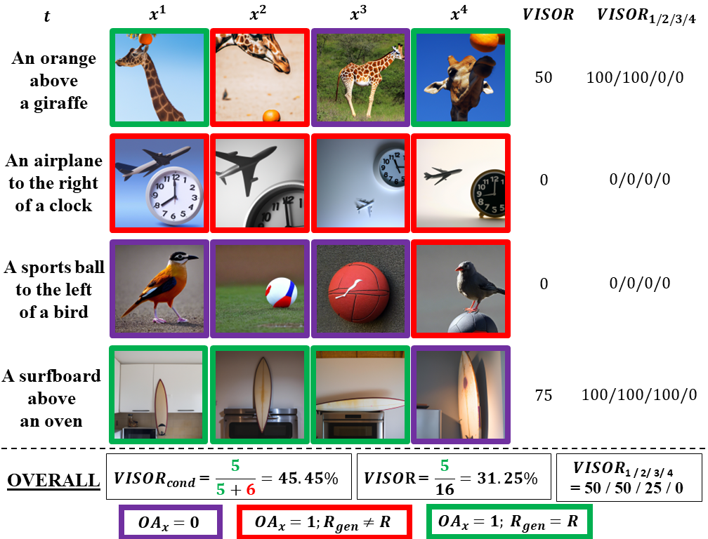

# Benchmarking Spatial Relationships in Text-to-Image Generation
*You can download the report from [here](https://arxiv.org/abs/2212.10015).*

*For further questions, please reach out to Tejas Gokhale (gokhale@umbc.edu) and Hamid Palangi (hpalangi@microsoft.com)*

<!--  -->
<p align=center>
  
</p>

- We introduce a large-scale challenge dataset SR<sub>2D</sub> that contains sentences describing two objects and the spatial relationship between them.
- We introduce a metric called VISOR (short for **V**erify**I**ng **S**patial **O**bject **R**elationships) to quantify spatial reasoning performance.  
- VISOR and SR<sub>2D</sub> can be used off-the-shelf with any text-to-image model.

## SR<sub>2D</sub> Dataset
Our dataset is hosted as a Huggingface Dataset [here](https://huggingface.co/datasets/tgokhale/sr2d_visor).  This contains 
1. The text prompt dataset in `.json` format (`text_spatial_rel_phrases.json`)
2. Images generated using 7 models (GLIDE, CogView2, DALLE-mini, Stable Diffusion, GLIDE + Stable Diffusion + CDM, and Stable Diffusion v2.1) 

Alternatively, the text prompt dataset can also accessed from [`text_spatial_rel_phrases.json`](https://github.com/microsoft/VISOR/blob/main/text_spatial_rel_phrases.json). It contains all examples from the current version of the dataset (31680 text prompts) accompanied by the corresponding metadata.
This dataset can also be generated by running the script `python create_spatial_phrases.py`


## Generating Images
In our experiments, we generated images for each text prompt in SR<sub>2d</sub> for 5 models: *[GLIDE](https://arxiv.org/abs/2112.10741), [DALLE-mini](https://github.com/borisdayma/dalle-mini), [CogView2](https://arxiv.org/abs/2204.14217), [DALLE-v2](https://cdn.openai.com/papers/dall-e-2.pdf), [Stable Diffusion](https://arxiv.org/abs/2112.10752) (SD)* as well as [Composable Diffusion Models](https://arxiv.org/abs/2206.01714) (CDM) with GLIDE (GLIDE + CDM) and SD (SD + CDM). See acknowledgments below for the corresponding codebases / APIs.

In this repository, we provide a few output images in the `images` directory, as well as a [webpage](https://visort2i.github.io/) or `viz.html` for visualizing them.

## Scripts for Evaluation
### Formatting for Object Detection results

In `objdet_results` we provide `.json` files that contain object detection results using OWL-ViT for images generated by eight state-of-the-art diffusion models (GLIDE, GLIDE+CDM, DALLE-mini, CogView2, DALLE-v2, Stable Diffusion, SD+CDM, and SD-2.1).
The format of these results file is simple -- each file contains a dictionary with keys being the filenames of images and values being the object detection results for that image.  These object detection results are themselves dictionaries, which contain a list of `classes`, corresponding `centroids` of bounding boxes, `recall` (number of detected objects), `sra` (`recall` divided by total number of expected objects) and the `text` prompt.

An example is shown below:
```
{
"1103_0": {
    "classes": [
      "kite"
    ],
    "centroid": [
      [
        170.64540100097656,
        135.6916046142578
      ]
    ],
    "recall": 1,
    "sra": 0,
    "text": "a kite to the right of a bicycle"
  },
  "11036_1": {
    "classes": [
      "cat"
    ],
    "centroid": [
      [
        170.22688674926758,
        108.26640701293945
      ]
    ],
    "recall": 1,
    "sra": 0,
    "text": "a cat below a bottle"
  }
}
```
If you want to use your own results, please convert them to the above format and name the file `results_<model_name>_<dataset_file_name>_<object_detector_name>_<threshold>.json`.
For example: `results_dallev2_text_spatial_rel_phrases_owlvit_0.1.json`

### Running VISOR
Once the object detection results are setup as described above, run the visor evaluation code:
```
python visor.py --text_json <path_to_SR2D_data> 
```
We also provide the functionality of running the evaluation for specific models as comma-separated arguments:
```
python visor.py --text_json <path_to_SR2D_data> --mo glide,dallev2,stable-diffusion
```

## Notebook for Evaluation
The notebook `text2image_realtime_evaluate.ipynb` offers a walk-through for using VISOR to evaluate the generated images and obtaining the VISOR scores for each model.
This notebook also includes the pipeline for using OWL-ViT object detection.

## Results from the Paper
Benchmarking results are shown below:

| Model  | OA | VISOR_uncond | VISOR_cond | VISOR_1 | VISOR_2 | VISOR_3 | VISOR_4 |
| ---- | ---- | ---- | ---- | ---- | ---- | ---- | ---- |
| GLIDE       |  3.36 |  1.98 | 59.06 |  6.72 |  1.02 |  0.17 | 0.03 |
| GLIDE + CDM | 10.17 |  6.43 | 63.21 | 20.07 |  4.69 |  0.83 | 0.11 |
| DALLE-mini  | 27.10 | 16.17 | 59.67 | 38.31 | 17.50 |  6.89 | 1.96 |
| CogView2    | 18.47 | 12.17 | 65.89 | 33.47 | 11.43 |  3.22 | 0.57 |
| DALLE-v2    | 63.93 | 37.89 | 59.27 | 73.59 | 47.23 | 23.26 | 7.49 |
| SD          | 29.86 | 18.81 | 62.98 | 46.60 | 20.11 |  6.89 | 1.63 |
| SD + CDM    | 23.27 | 14.99 | 64.41 | 39.44 | 14.56 |  4.84 | 1.12 |
| SD 2.1      | 47.83 | 30.25 | 63.24 | 64.42 | 35.74 | 16.13 | 4.70 |

## References
Code for text-to-image generation:
1. GLIDE: https://github.com/openai/glide-text2im
2. DALLE-mini: https://github.com/borisdayma/dalle-mini
3. CogView2: https://github.com/THUDM/CogView2
4. Stable Diffusion: https://github.com/CompVis/stable-diffusion
5. Composable Diffusion Models: https://github.com/energy-based-model/Compositional-Visual-Generation-with-Composable-Diffusion-Models-PyTorch
6. OpenAI API for DALLE-2: https://openai.com/api/

## Citation
If you find SR<sub>2D</sub> or VISOR useful in your research, please use the following citation:
```
@article{gokhale2022benchmarking,
  title={Benchmarking Spatial Relationships in Text-to-Image Generation},
  author={Gokhale, Tejas and Palangi, Hamid and Nushi, Besmira and Vineet, Vibhav and Horvitz, Eric and Kamar, Ece and Baral, Chitta and Yang, Yezhou},
  journal={arXiv preprint arXiv:2212.10015},
  year={2022}
}
```
